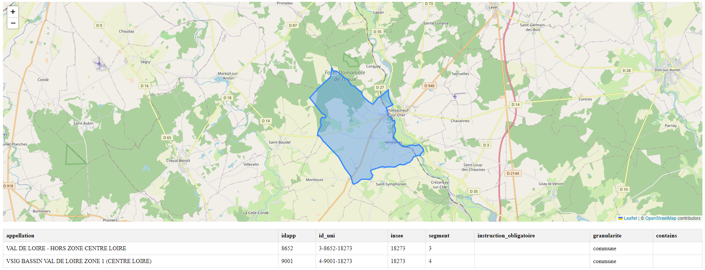

# ChatGPT (GPT-4o) - Afficher les appellations viticoles sur une carte LeafLet en appelant APICARTO

## Expérimentation

Je débute avec le prompt suivant :

> Peux tu me produire une page HTML avec une carte LeafLet qui affiche la liste des appellations viticole couvrant une parcelle lorsque l'on clique sur la carte?

Plusieurs précisions sont nécessaires (c.f. https://chatgpt.com/share/fb98c25c-e0e8-4424-991d-885dd99b634c) mais je finis par avoir une [démonstration](demo/index.html) fonctionnelle :

Pour finaliser, il conviendrait principalement de :

* Zoomer sur les résultats
* Remplacer le fond de plan par un fond IGN
* Ajouter un formulaire de localisation
* Comprendre pourquoi une seule géométrie s'affiche (petit bug?)

Nous avons en tout cas une base de travail intéressante même si nous repassons en pilotage manuel.

## Analyse de la réponse

Tout le jeu consiste à être assez précis pour que ChatGPT comprenne ce qu'on veut. Dans le cas présent, il est intéressant de noter que ces réponses tendrait à retoucher quelques points dans les spécifications de l'API utilisée.

## Remarques

Je tente à la fin d'améliorer mon prompt initial à l'aide de ChatGPT avec la question suivante :

> Peux tu me faire un prompt unique qui amène à ce résultat?

La réponse suivante de ChatGPT sera utilisée si je prend un peu de temps pour un deuxième test :

"Voici un prompt unique pour créer une page HTML affichant une carte Leaflet. Lorsqu'on clique sur la carte, les appellations viticoles couvrant la parcelle cliquée sont récupérées via l'API APICARTO de l'IGN et affichées dans un tableau sous la carte. Les résultats précédents sont supprimés à chaque clic"

