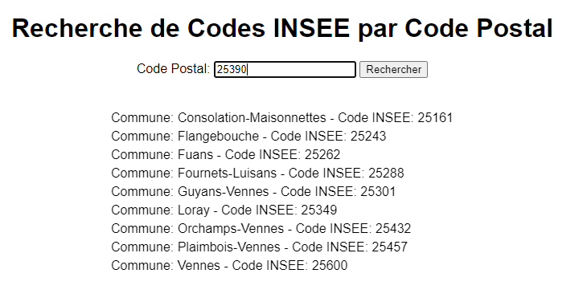
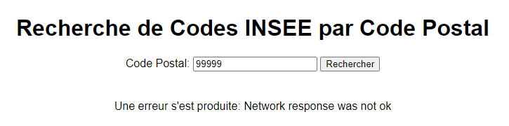

# ChatGPT (GPT-4o) - Afficher les codes INSEE correspondant à un Code Postal en appelant APICARTO

## Contexte

* Compte gratuit [chatgpt.com](https://chatgpt.com/)
* Modèle : GPT-4o
* Date : 16/06/2024

## Expérimentation

Le prompt utilisé sur ChatGPT est le suivant :

> Peux-tu m'écrire une page HTML et JavaScript permettant d'afficher la liste des codes INSEE correspondant à un code code postal à l'aide d'un appel à APICARTO?
>
> c.f. [https://chatgpt.com/share/cca3eb87-4f1f-476e-8516-99f851596e73](https://chatgpt.com/share/cca3eb87-4f1f-476e-8516-99f851596e73)

Nous obtenons une [démonstration qui fonctionne sur le cas nominal](demo/index.html) :

Il n'y a pas de distinction sur les types d'erreur (400 pour code postal mal formaté, 404 pour code postal non trouvé):

Il serait intéressant de voir si l'[amélioration de la description des codes d'erreurs au niveau des spécifications OpenAPI](https://apicarto.ign.fr/api/doc/codes-postaux) permet d'y remédier.

## Analyse de la réponse

 pour la [réponse brute archivée dans le dépôt](reponse-brute.md)

Voir commentaire ajouté dans [index.html](https://github.com/mborne/llm-experimentations/blob/main/apicarto-codes-postaux/demo/index.html) et [app.js](https://github.com/mborne/llm-experimentations/blob/main/apicarto-codes-postaux/app.js). Par rapport à de précédents tests avec le modèle GPT 3.5, je note principalement avec cette expérimentation que **ChatGPT (GPT-4o) est capable de trouver et lire en profondeur des spécifications OpenAPI exposées sur internet**.

