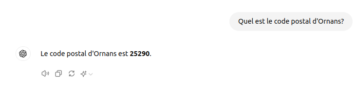
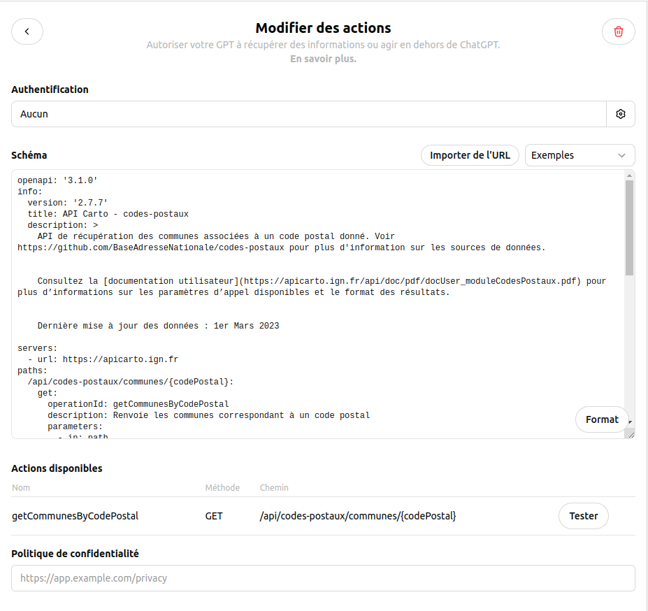
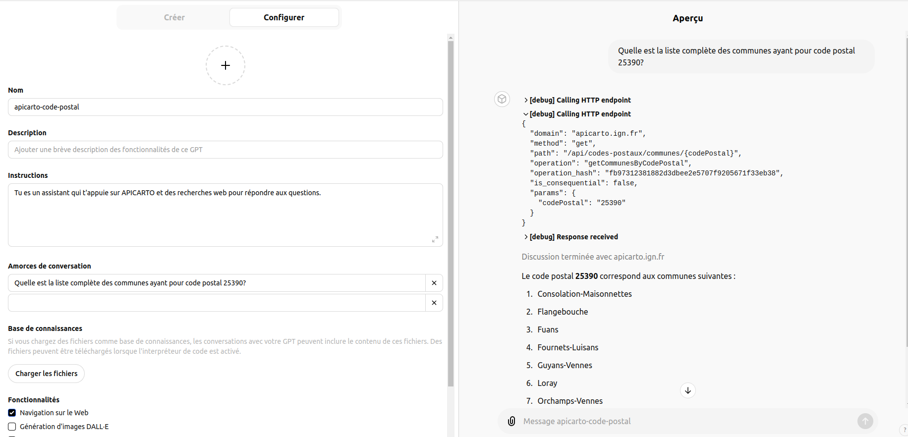
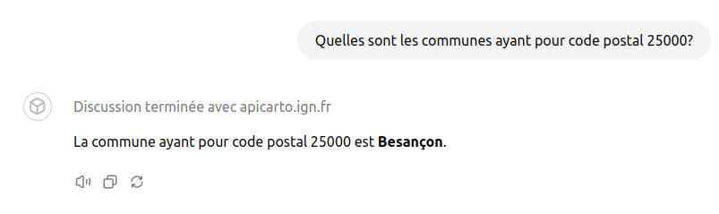

# ChatGPT - Intégration du module APICARTO codes-postaux sous forme d'une action

## Contexte

Par défaut, ChatGPT répond de manière erronée à la question **"Quelles sont les communes ayant pour code postal 25390?"** :

Paradoxalement, il répond de manière correcte à la question "Quel est le code postal d'Ornans" :

Cette incohérence dans les réponses qu'**un LLM ne raisonne pas**. Pour que ChatGPT soit en mesure de répondre correctement à la question initiale, nous pouvons faire en sorte qu'il fasse **appel au [module code postal d'APICARTO](https://apicarto.ign.fr/api/doc/codes-postaux)** ( https://apicarto.ign.fr/api/codes-postaux/communes/25390 ) pour **enrichir son contexte avant qu'il formule la réponse**.

## Configuration de l'action

Nous pouvons intégrer les spécifications du module (c.f. [apicarto-code-postal.yml](apicarto-code-postal.yml)) sous forme d'une action :

## Test

Nous constatons alors les appels à l'APICARTO pour répondre à :

* **"Quelles sont les communes ayant pour code postal 25390?"** :

* **"Quelles sont les communes ayant pour code postal 25000?"** :

## Remarques

Voir [github.com - IGNF/apicarto - Documentation - mise à jour des spécifications des API](https://github.com/IGNF/apicarto/issues/109) pour les actions en cours au niveau APICARTO.

