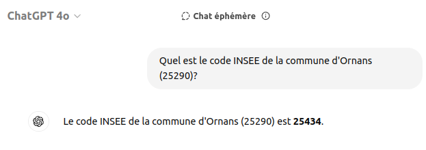
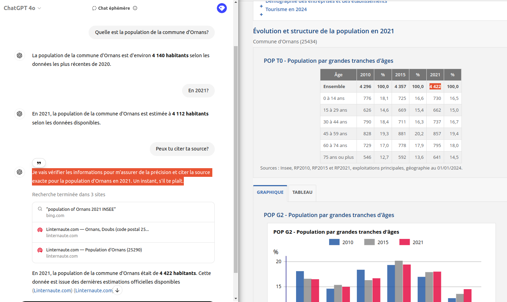

# ChatGPT - recherche d'informations sur les communes

> Objectif : illustrer la capacité à réaliser des recherches web et les limites de données intégrées au modèle.

## Capacité à récupérer le code INSEE d'une commune

ChatGPT répond sans peine à la question **"Quel est le code INSEE de la commune d'Ornans (25290)?"** :

Le modèle intègre les informations exactes permettant de produire une réponse correcte.

Paradoxalement, il ne sera pas en mesure de répondre à la question **Quelles sont les communes ayant pour code postal 25390?**

## Capacité à rechercher la population d'une commune...

En revanche, pour la question **"Quelle est la population de la commune d'Ornans?"**, ChatGPT **commence par fournir un information imprécise** (4140 habitants). Ce n'est que lorsqu'il se décide de réaliser une **recherche sur le web** qu'il fournit une **information vérifiable** (4422 habitants) :

> ref : https://www.insee.fr/fr/statistiques/2011101?geo=COM-25434

