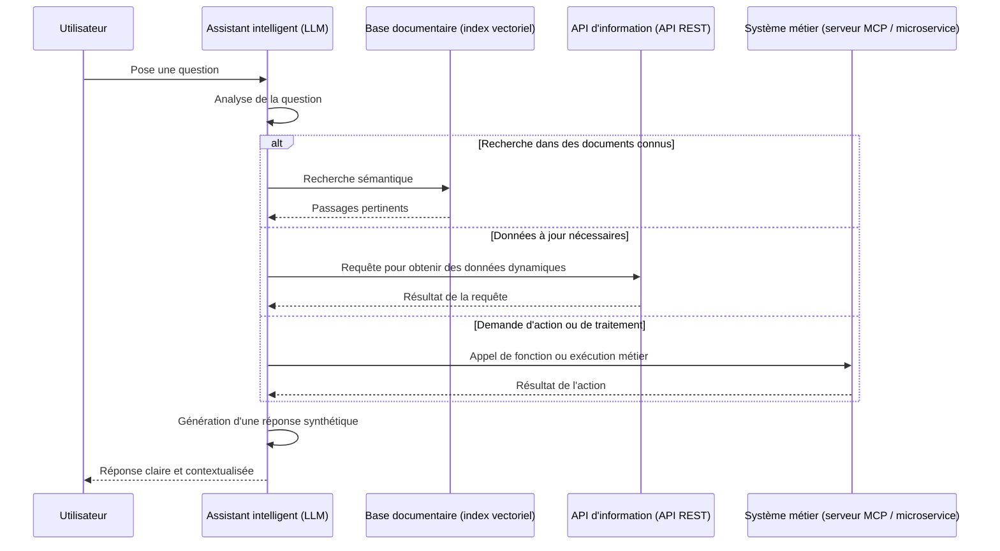

# 🧠 RAG & Tool Calling : Accès intelligent à l'information et aux actions via les LLM

> **ATTENTION**: Le contenu suivant est généré par nettoyage d'un résultat obtenu après plusieurs échanges avec ChatGPT (c.f. [rag-et-toolcalling.md](rag-et-toolcalling.md)).

## Introduction

Les modèles de langage (LLM) sont puissants, mais ils n'ont pas toujours accès à l'information la plus à jour ni aux systèmes métier spécifiques. Deux techniques clés permettent de pallier ces limitations :

* **RAG (Retrieval-Augmented Generation)** : enrichit le raisonnement du LLM par des recherches documentaires internes ou externes.
* **Tool Calling** : permet au LLM d'interagir avec des services externes (API REST, moteurs métier, fonctions techniques) pour obtenir des données ou exécuter des actions.([arXiv][1])

---

## 🔍 Les trois grandes familles d’accès à l’information

| Type de besoin                    | Source sollicitée                                              | Exemple technique                     |   |
| --------------------------------- | -------------------------------------------------------------- | ------------------------------------- | - |
| Répondre à une question générale  | Documents internes ou bases de connaissances (PDF, wiki, etc.) | Index vectoriel (FAISS, Qdrant…)      |   |
| Fournir une info à jour           | API REST ou flux en temps réel                                 | Open Data, météo, trafic, etc.        |   |
| Déclencher une action ou workflow | Système métier (via microservices ou MCP)                      | Création de compte, réservation, etc. |   |

---

## 📊 Diagramme de séquence : Traitement d'une requête utilisateur

Ce diagramme illustre comment un assistant intelligent traite une requête en choisissant la bonne source d’information ou d’action :

---

## 💡 Exemples d'usages concrets

### 🔎 Récupération documentaire (RAG "classique")

* Accès à des notes internes ou extraits de conventions collectives.
* Synthèse automatisée de plusieurs documents réglementaires.
* Recherche sémantique dans les archives.

### 🌐 Appels à des API REST (Tool Calling d'information)

* `GET /horaires/train/TER123` → horaires en temps réel (SNCF)
* `GET /indicateurs/budget` → données financières actualisées
* `GET /meteo?ville=Marseille` → température du jour
* `GET /geoportail/wfs` → couche géographique dynamique([Florian Wolf][2])

### ⚙️ Appels à des serveurs MCP ou microservices (Tool Calling d’action)

* `POST /demande-mobilité` → soumettre une demande RH
* `PUT /congés/valider` → valider une demande de congé
* `POST /dossier/ouvrir` → ouverture d’un dossier administratif
* `POST /calcul/taux-ajusté` → exécution d’un moteur métier([Generative AI][3])

---

## 🎨 Personnalisation du rendu avec HTML/CSS/JS

Une fois que vous avez mis en place un assistant LLM basé sur RAG et Tool Calling, vous pouvez enrichir l'expérience utilisateur grâce à JavaScript, HTML et CSS, en particulier pour personnaliser le rendu.

Par exemple, pour un rendu cartographique, vous pouvez intégrer des bibliothèques JavaScript telles que Leaflet ou Mapbox pour afficher des cartes interactives basées sur les données récupérées via Tool Calling.

---

## ✅ En résumé

Les assistants LLM modernes ne se limitent plus à "faire du texte" : ils deviennent des interfaces universelles capables de :

* **trouver**, **comprendre** et **synthétiser** les documents internes ;
* **accéder à des données dynamiques** par des API ;
* **agir concrètement dans vos systèmes** via des fonctions ou services métiers.

Le tout de façon fluide, intelligente, et adaptée à chaque cas d’usage.([useparagon.com][4])

---

[1]: https://arxiv.org/abs/2404.17897?utm_source=chatgpt.com "Tool Calling: Enhancing Medication Consultation via Retrieval-Augmented Large Language Models"
[2]: https://www.fwolf.io/blog/llm-rag-tool-calls?utm_source=chatgpt.com "What is RAG? What are tool calls? And why is this important? | Florian Wolf"
[3]: https://generativeai.pub/building-an-rag-system-integrated-with-function-calling-chatgpt-4-967d2e453004?gi=1b2195041e54&utm_source=chatgpt.com "Building an RAG system integrated with Function Calling (ChatGPT-4) | by Dane Allist | Generative AI"
[4]: https://www.useparagon.com/learn/rag-best-practices-optimizing-tool-calling/?utm_source=chatgpt.com "RAG Best Practices: Optimizing Tool Calling | Learn from Paragon"
