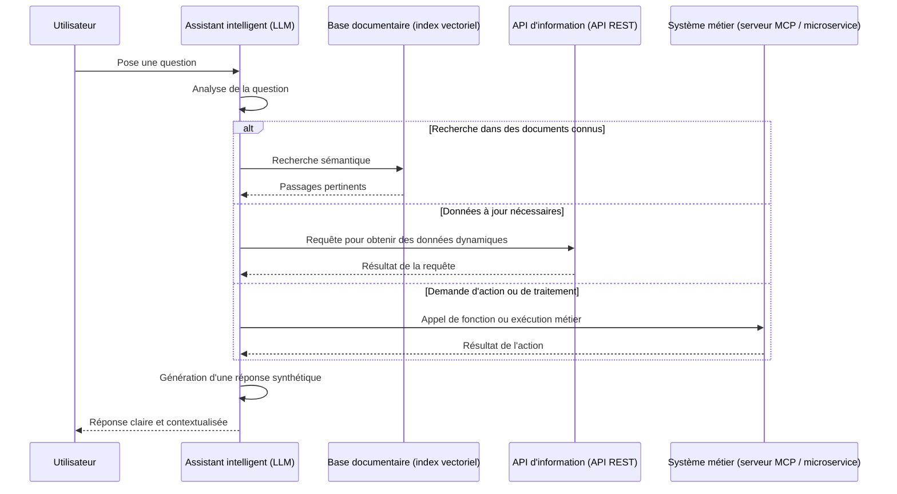

# 🧠 RAG & Tool-Calling : Comment les LLM accèdent à la bonne information ou agissent intelligemment

> **ATTENTION**: Le contenu suivant est généré à l'aide de quelques échanges avec ChatGPT utilisé en temps qu'expert (il y a quelques coquilles : rien n'empêche d'utiliser un MCP pour accéder à une information à jour).

## 📌 Introduction

Les **LLM (modèles de langage)** sont puissants… mais ils n'ont pas toujours accès à **l'information la plus à jour**, ni aux systèmes métier de votre organisation.
C’est là qu’interviennent deux techniques clés :

* Le **RAG** (*Retrieval-Augmented Generation*) : enrichir le raisonnement du LLM par des recherches documentaires internes ou externes.
* Le **Tool-calling** : permettre au LLM **d’interagir avec des services externes** (API REST, moteurs métier, fonctions techniques) pour obtenir des données ou exécuter des actions.

---

## 🔍 Les trois grandes familles d’accès à l’information

| Type de besoin                           | Source sollicitée                                              | Exemple technique                     |
| ---------------------------------------- | -------------------------------------------------------------- | ------------------------------------- |
| 💬 **Répondre à une question générale**  | Documents internes ou bases de connaissances (PDF, wiki, etc.) | Index vectoriel (FAISS, Qdrant…)      |
| 📅 **Fournir une info à jour**           | API REST ou flux en temps réel                                 | Open Data, météo, trafic, etc.        |
| ⚙️ **Déclencher une action ou workflow** | Système métier (via microservices ou MCP)                      | Création de compte, réservation, etc. |

---

## 🧭 Diagramme de séquence (version décideur + vocabulaire technique)

Ce diagramme illustre comment un assistant intelligent traite une requête en choisissant **la bonne source d’information ou d’action** :

---

## 📚 Exemples d'usage concrets

### 🔎 Récupération documentaire (RAG "classique")

* Accès à des notes internes ou extraits de conventions collectives.
* Synthèse automatisée de plusieurs documents réglementaires.
* Recherche sémantique dans les archives.

### 🌐 Appels à des API REST (tool-calling d'information)

* `GET /horaires/train/TER123` → horaires en temps réel (SNCF)
* `GET /indicateurs/budget` → données financières actualisées
* `GET /meteo?ville=Marseille` → température du jour
* `GET /geoportail/wfs` → couche géographique dynamique

### ⚙️ Appels à des serveurs MCP ou microservices (tool-calling d’action)

* `POST /demande-mobilité` → soumettre une demande RH
* `PUT /congés/valider` → valider une demande de congé
* `POST /dossier/ouvrir` → ouverture d’un dossier administratif
* `POST /calcul/taux-ajusté` → exécution d’un moteur métier

---

## 🧩 En résumé

Les assistants LLM modernes ne se limitent plus à "faire du texte" :
ils deviennent **des interfaces universelles** capables de :

* **trouver**, **comprendre** et **synthétiser** les documents internes ;
* **accéder à des données dynamiques** par des API ;
* **agir concrètement dans vos systèmes** via des fonctions ou services métiers.

👉 Le tout de façon fluide, intelligente, et adaptée à chaque cas d’usage.

---

> Peux tu expliquer brièvement comment on peut compléter tout ça avec l'utilisation de JavaScript, HTML et CSS pour personnalisation le rendu (ex : rendu cartographique)?

## Pourquoi HTML/CSS/JS avec RAG + Tool-Calling ?

Bien sûr ! Une fois que tu as mis en place un assistant LLM basé sur RAG + Tool-Calling, tu peux **enrichir l'expérience utilisateur** grâce à **JavaScript, HTML et CSS**, en particulier pour **personnaliser le rendu des réponses**.

Voici une brève explication de **comment et pourquoi utiliser ces technologies côté interface** :

---

### 🖼️ Pourquoi HTML/CSS/JS avec RAG + Tool-Calling ?

L’assistant peut te renvoyer :

* des **données brutes** (résultats de recherche, JSON, coordonnées, etc.),
* ou des **réponses enrichies** que tu peux rendre plus visuelles et interactives côté front.

Tu peux alors **convertir les résultats** en :

* 📊 **Graphiques** (avec Chart.js, Recharts…)
* 🗺️ **Cartes interactives** (Leaflet, MapLibre, Mapbox…)
* 📋 **Fiches dynamiques** avec filtres ou onglets
* 🧩 **Composants métiers** (ex: timelines, Gantt, workflow, etc.)

### 🔧 Autres cas d’usage de JavaScript + HTML/CSS

| Objectif                | Librairies ou technologies utiles      |
| ----------------------- | -------------------------------------- |
| Graphiques interactifs  | Chart.js, D3.js, Recharts              |
| Cartes dynamiques       | Leaflet, MapLibre, Mapbox GL JS        |
| Interfaces filtrables   | React, Vue.js, Alpine.js               |
| Habillage responsive    | Tailwind CSS, Bootstrap                |
| Composants LLM "riches" | WebComponents, Markdown + JS dynamique |

---

### 📦 Intégration dans un assistant existant

1. **Appel d'API** via tool-calling → réponse JSON ou GeoJSON
2. **Le front lit la réponse** via JavaScript
3. **HTML/CSS/JS affichent la réponse** de manière visuelle, interactive, contextuelle
