# 🧠 RAG & Tool-Calling : Comment les LLM accèdent à la bonne information ou agissent intelligemment

> **ATTENTION**: Le contenu suivant est généré à l'aide de quelques échanges avec ChatGPT utilisé en temps qu'expert (il y a quelques coquilles : rien n'empêche d'utiliser un MCP pour accéder à une information à jour).

## 📌 Introduction

Les **LLM (modèles de langage)** sont puissants… mais ils n'ont pas toujours accès à **l'information la plus à jour**, ni aux systèmes métier de votre organisation.
C’est là qu’interviennent deux techniques clés :

* Le **RAG** (*Retrieval-Augmented Generation*) : enrichir le raisonnement du LLM par des recherches documentaires internes ou externes.
* Le **Tool-calling** : permettre au LLM **d’interagir avec des services externes** (API REST, moteurs métier, fonctions techniques) pour obtenir des données ou exécuter des actions.

---

## 🔍 Les trois grandes familles d’accès à l’information

| Type de besoin                           | Source sollicitée                                              | Exemple technique                     |
| ---------------------------------------- | -------------------------------------------------------------- | ------------------------------------- |
| 💬 **Répondre à une question générale**  | Documents internes ou bases de connaissances (PDF, wiki, etc.) | Index vectoriel (FAISS, Qdrant…)      |
| 📅 **Fournir une info à jour**           | API REST ou flux en temps réel                                 | Open Data, météo, trafic, etc.        |
| ⚙️ **Déclencher une action ou workflow** | Système métier (via microservices ou MCP)                      | Création de compte, réservation, etc. |

---

## 🧭 Diagramme de séquence (version décideur + vocabulaire technique)

Ce diagramme illustre comment un assistant intelligent traite une requête en choisissant **la bonne source d’information ou d’action** :

```mermaid
sequenceDiagram
    participant Utilisateur
    participant Assistant intelligent (LLM)
    participant Base documentaire (index vectoriel)
    participant API d'information (API REST)
    participant Système métier (serveur MCP / microservice)

    Utilisateur->>Assistant intelligent (LLM): Pose une question
    Assistant intelligent (LLM)->>Assistant intelligent (LLM): Analyse de la question

    alt Recherche dans des documents connus
        Assistant intelligent (LLM)->>Base documentaire (index vectoriel): Recherche sémantique
        Base documentaire (index vectoriel)-->>Assistant intelligent (LLM): Passages pertinents
    else Données à jour nécessaires
        Assistant intelligent (LLM)->>API d'information (API REST): Requête pour obtenir des données dynamiques
        API d'information (API REST)-->>Assistant intelligent (LLM): Résultat de la requête
    else Demande d'action ou de traitement
        Assistant intelligent (LLM)->>Système métier (serveur MCP / microservice): Appel de fonction ou exécution métier
        Système métier (serveur MCP / microservice)-->>Assistant intelligent (LLM): Résultat de l'action
    end

    Assistant intelligent (LLM)->>Assistant intelligent (LLM): Génération d'une réponse synthétique
    Assistant intelligent (LLM)-->>Utilisateur: Réponse claire et contextualisée
```

---

## 📚 Exemples d'usage concrets

### 🔎 Récupération documentaire (RAG "classique")

* Accès à des notes internes ou extraits de conventions collectives.
* Synthèse automatisée de plusieurs documents réglementaires.
* Recherche sémantique dans les archives.

### 🌐 Appels à des API REST (tool-calling d'information)

* `GET /horaires/train/TER123` → horaires en temps réel (SNCF)
* `GET /indicateurs/budget` → données financières actualisées
* `GET /meteo?ville=Marseille` → température du jour
* `GET /geoportail/wfs` → couche géographique dynamique

### ⚙️ Appels à des serveurs MCP ou microservices (tool-calling d’action)

* `POST /demande-mobilité` → soumettre une demande RH
* `PUT /congés/valider` → valider une demande de congé
* `POST /dossier/ouvrir` → ouverture d’un dossier administratif
* `POST /calcul/taux-ajusté` → exécution d’un moteur métier

---

## 🧩 En résumé

Les assistants LLM modernes ne se limitent plus à "faire du texte" :
ils deviennent **des interfaces universelles** capables de :

* **trouver**, **comprendre** et **synthétiser** les documents internes ;
* **accéder à des données dynamiques** par des API ;
* **agir concrètement dans vos systèmes** via des fonctions ou services métiers.

👉 Le tout de façon fluide, intelligente, et adaptée à chaque cas d’usage.
