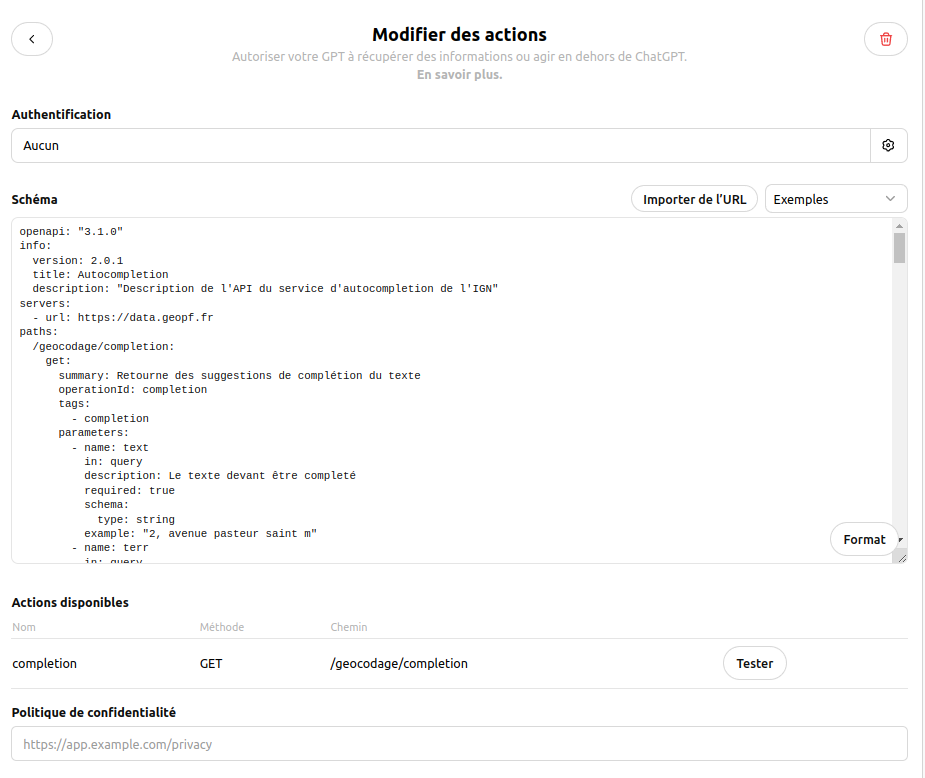
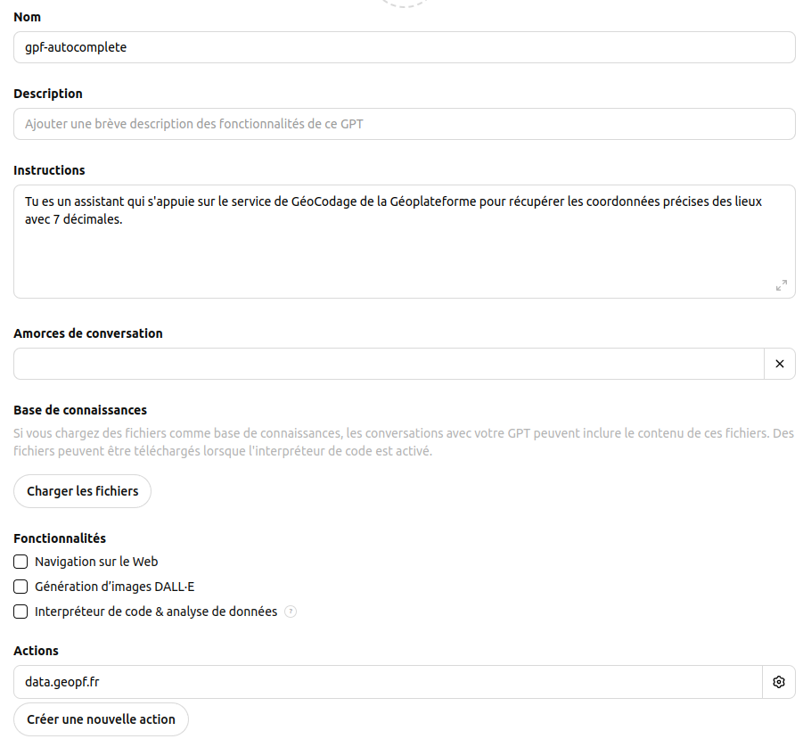
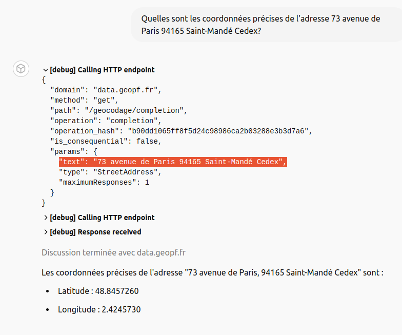
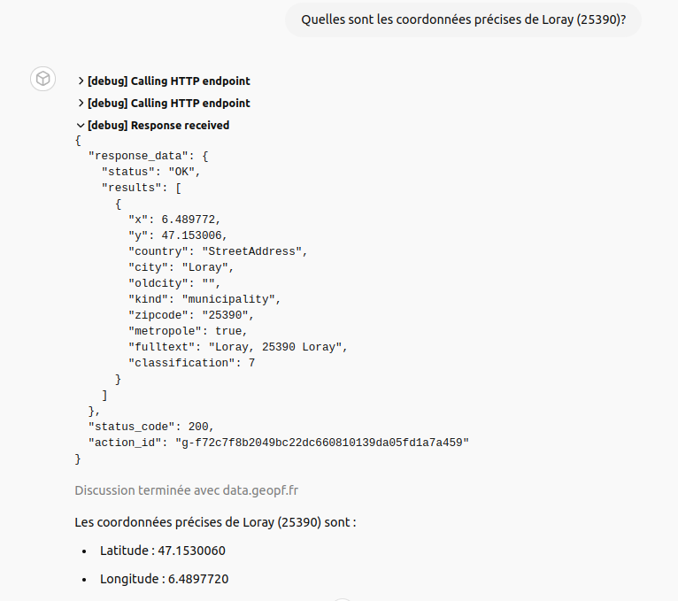
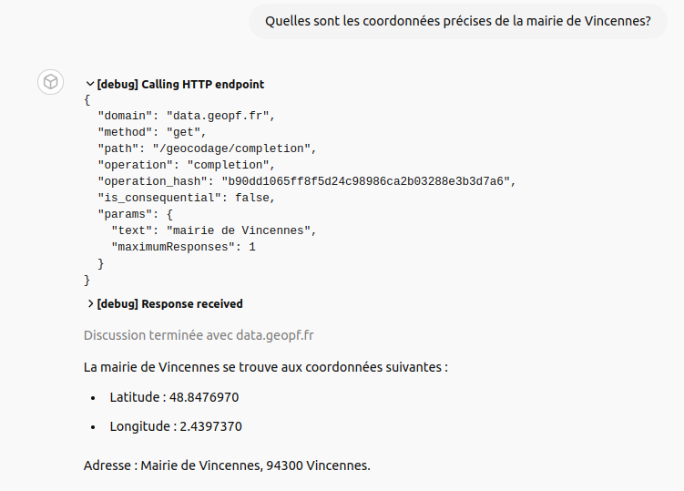

# ChatGPT - intégration du service de géocodage de la GéoPlateforme

## Contexte

[ChatGPT est capable de fournir les coordonnées des lieux mais il est limité dans la mesure où il ne réalise pas des appels à de véritables services de géocodage](../chatgpt-geocodage-limites/README.md).

Il est toutefois **possible d'intégrer un service de géocodage** tel le [service d'autocomplétion de la GéoPlateforme](https://geoservices.ign.fr/documentation/services/services-geoplateforme/autocompletion) **sous forme d'une action** à l'aide des spécifications OpenAPI (c.f. [gpf-autocomplete.yaml](gpf-autocomplete.yaml) où capabilities est supprimé par rapport à l'original)

## Configuration de l'action

Nous pouvons guider ChatGPT pour qu'il utilise de préférence cette source ;

## Test avec quelques cas

### Test avec l'adresse IGN Saint-Mandé

-> https://www.openstreetmap.org/?mlat=48.8457260&mlon=2.4245730#map=17/48.84579/2.41978 : **OK**

### Test avec le nom d'un village

-> https://www.openstreetmap.org/?mlat=47.1530060&mlon=6.4897720#map=15/47.1529/6.4920 : **OK**

### Test avec la mairie de Vincennes

-> https://www.openstreetmap.org/?mlat=48.8476970&mlon=2.4397370#map=19/48.84770/2.43982 : **OK**
