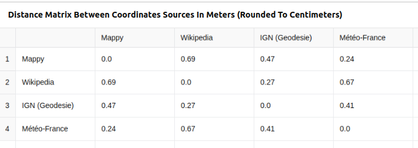

# ChatGPT - les limites des capacités de géocodage par défaut

## Des positions pas toujours précises dans la mémoire...

ChatGPT connait la **position précise de la tour Eiffel** :

ChatGPT connaît aussi la **position précise pour les villes** :

La position connue **pour les villages** est plus approximative avec **plusieurs kilomètres de décallage** :

 

Il faudra **faire en sorte que ChatGPT procède à une recherche pour obtenir une précision correcte** :

> https://www.openstreetmap.org/?mlat=47.159651&mlon=6.496659#map=15/47.159651/6.496659

## Un géocodage d'adresse hasardeux

De même, le **géocodage d'adresse** rencontre visiblement des limites avec un **imprécision plus de 100 mètres pour le géocodage de l'adresse du site IGN de Saint-Mandé** :

Il est alors tentant de **demander à ChatGPT de procéder à une recherche sur le web** mais **la précision se dégrade encore** : 

## Un géodocage ou une recherche web?

### Cas de l'adresse IGN

En posant la question suivante, il est possible de comprendre les limites du traitement réalisé par ChatGPT :

Nous remarquons en effet que **ChatGPT procède au géocodage à l'aide d'une recherche web classique** (il ne fait appel à un service dédié au géocodage). En outre, il est étonnant de constater une **cohérence dans les résultats des différentes sources** :

...mais un **biais de 500m difficile à expliquer** :

### Cas de la mairie de Vincennes

Un test avec le cas de la **"mairie de Vincennes"** confirme une recherche web standard avec l'utilisation de sources différentes :

La visualisation de la distribution des résultats donne une idée de la précision :

## Conclusion

Pour une meilleure précision et une meilleure maîtrise, il semble intéressant d'**intégrer un véritable service de géocodage**.

Voir [ChatGPT - intégration du service de géocodage de la GéoPlateforme](chatgpt-gpt4o-geocodage-gpf.md) pour un exemple avec celui de la GéoPlateforme.

