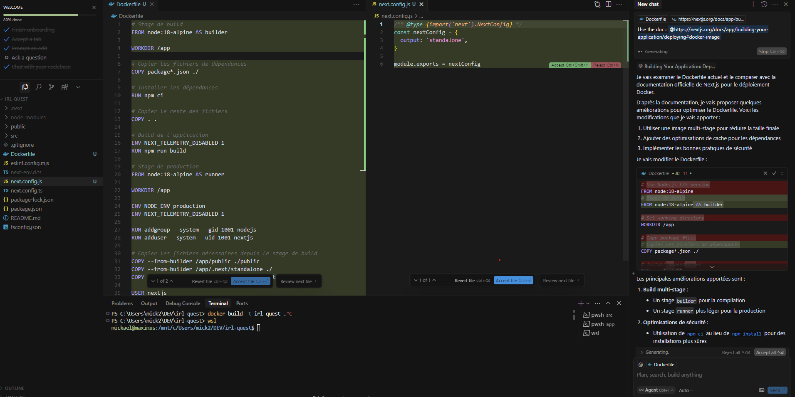
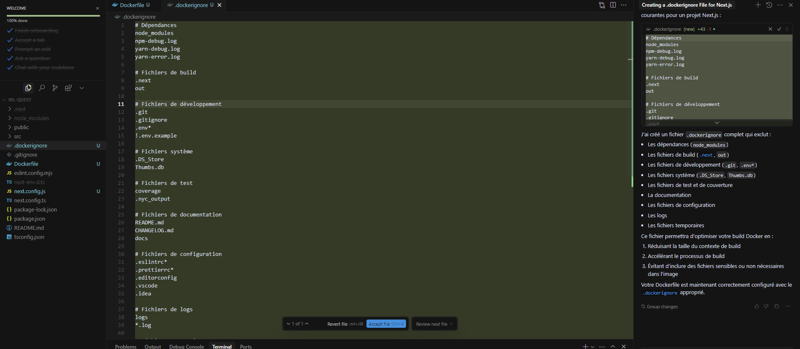

# Cursor - quelques tests de génération de code

## Construction d'une image docker pour une application NextJS

* `Generate a Dockerfile nextjs app` -> **KO, Dockerfile standard NodeJS**
* `use the doc : @https://nextjs.org/docs/app/building-your-application/deploying#docker-image` -> **Résultat bien plus proche de l'exemple pointé**

* `add missing .dockerignore file` -> **Le fichier manquant est généré, il inclue bien .nextjs** et de (trop?) nombreux autres fichiers éventuellement présents (fichiers d'IDE, tmp,...).

