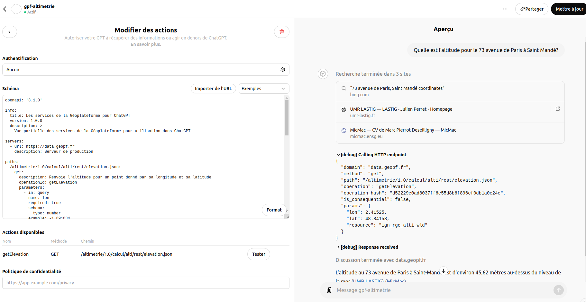

# Quelques notes sur un test intégration du service altimétrie de la Géoplateforme dans ChatGPT

## Principe

* [gpf-altitude.yaml](gpf-altitude.yaml) - Rédaction d'une document OpenAPI minimale pour le [service Géoplateforme de calcul altimétrique](https://geoservices.ign.fr/documentation/services/services-geoplateforme/altimetrie)

* Intégration sous forme d'une action ChatGPT :

 

* Prompt pour test :

```
Tu es un assistant fournissant diverses informations à l'aide d'appel aux API géoplateforme (data.geopf.fr). Au besoin, tu récupères les positions en faisant appels aux services de géocodage de google map.

Remarques : 

- Pour l'altimétrie, tu utiliseras resource=ign_rge_alti_wld
- Tu préciseras les sources des informations dans tes réponses
```

