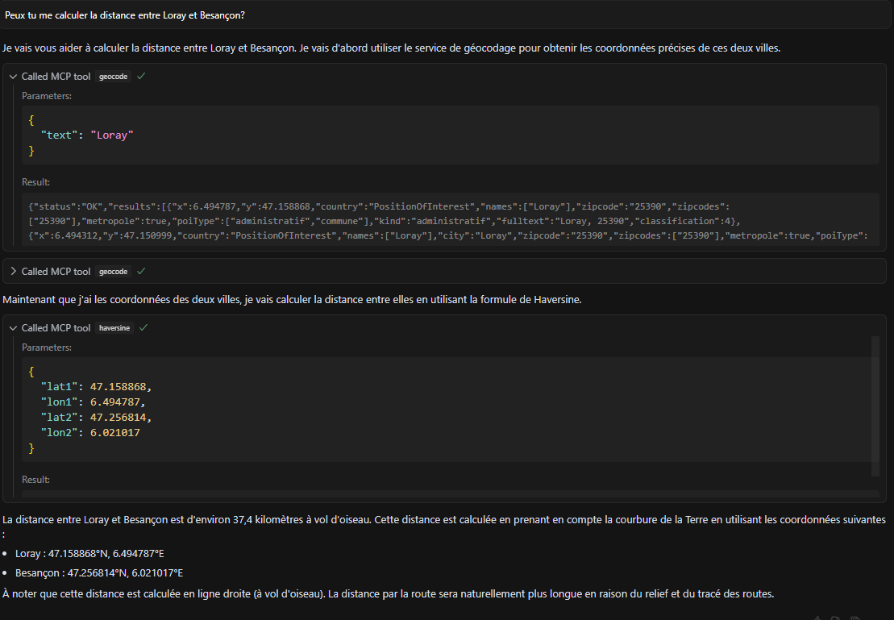

# mcp-server-gpf - test d'implémentation d'un serveur MCP appelant un service Géoplateforme

**Test** d'implémentation d'un [serveur MCP](https://github.com/modelcontextprotocol/servers?tab=readme-ov-file#model-context-protocol-servers) faisant appel au [service d'autocomplétion de la Géoplateforme](https://geoservices.ign.fr/documentation/services/services-geoplateforme/autocompletion) pour le géocodage.

## Motivation

* ChatGPT s'interface facilement avec des API REST/JSON sur la base des spécifications OpenAPI.
* Appeler une API demande plus de travail avec d'autres LLM (c.f. [LangChain / OpenApiToolkit](https://js.langchain.com/docs/integrations/toolkits/openapi/))
* https://mcp.so/ laisse penser que l'approche MCP gagne du terrain pour s'interfacer avec d'autres.
* Si on cible une surcouhe WFS, le gros du travail est dans l'écriture des fonctions utilitaires (-> tentant d'offrir deux modes dans [geocontext](https://github.com/mborne/geocontext) + d'ajouter des fonctionnalités WFS génériques)

## Exemple

Réponse à la question "peux-tu calculer la distance entre Loray et Besançon" par appel à :

* [geocode](src/tools/GeocodeTool.ts) pour le géocodage des deux lieux.
* [harsine](src/tools/Harversine.ts) pour le calcul d'une distance à vol d'oiseau.



## Utilisation

* Construction

```bash
cd mcp-server-gpf
npm run build
```

* Configurer l'utilisation du serveur :

```json
{
  "mcpServers": {
    "mcp-server-gpf": {
      "command": "node",
      "args": ["/absolute/path/to/mcp-server-gpf/dist/index.js"]
    }
  }
}
```

## Mise en garde

**Pas de support d'un proxy sortant** pour ce test.


## Ressources

* [mcp-framework.com - Quickstart](https://mcp-framework.com/docs/quickstart)

> Voir [HTTP with SSE](https://github.com/modelcontextprotocol/typescript-sdk?tab=readme-ov-file#http-with-sse) pour basculer en exposition sous forme d'un service HTTP.
